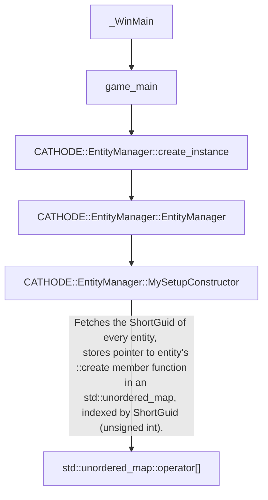

# Alien Isolation - iOS - CATHODE Setup Reference

CATHODE is configured on game boot dynamically, it does not hard-code entity ShortGuids (actually an `unsigned int`), nor does it hardcode pointers to entities.

CATHODE as a whole is set up to be very flexible and customisable, and the code has been structured using heavy amounts of C++ virtual inheritance to achieve this.

## Initial game startup flow

On game boot, in order to initialise the `EntityManager`, a call to the function `CATHODE::EntityManager::MySetupConstructor()` is fired from `CATHODE::EntityManager::EntityManager()`, 
which is called by `CATHODE::EntityManager::create_instance()`, which is called by `game_main()`, which is (finally) called by `_WinMain`.

CATHODE is "setup" with entities when this function is executed, the entities are stored in an `std::unordered_map`, with `unsigned int` (`ShortGuid`) as the hash key, 
and a pointer to a pointer to a `CATHODE::MemoryPtr<CATHODE::Entity> (*)(CATHODE::MemoryPtr<CATHODE::Entity> const&, CATHODE::EntityInitialiserData const&)` function 
(the entity creation function) as the value.

This way of setting up the scripting system is very flexible, as it allows _Creative Assembly_ to auto-generate the setup code for any new entity types (hence the source folder 
name of `Auto`), every entity is set up in the exact same way.

## Active gameplay flow
A call to the ``::setup`` function pointer, indexed by the entity's `ShortGuid` in the `std::unordered_map`, is all that is needed to construct a new instance of that entity.

During map load, a call to `CATHODE::EntityManager::construct_entity(CATHODE::MemoryPtr<CATHODE::Entity>*, CATHODE::EntityInitialiserData*)` is dispatched, this accesses the
`std::unordered_map` that was initialised on game startup earlier, and retrieves the pointer to the `::create` member function for the desired entity via its ShortGuid.

The `::create` function is called with the constructed `CATHODE::Entity` object being returned.
Any relevant initialisation data (such as the parent and child ShortGuid) is passed in via the second parameter (`CATHODE::EntityInitialiserData`).

